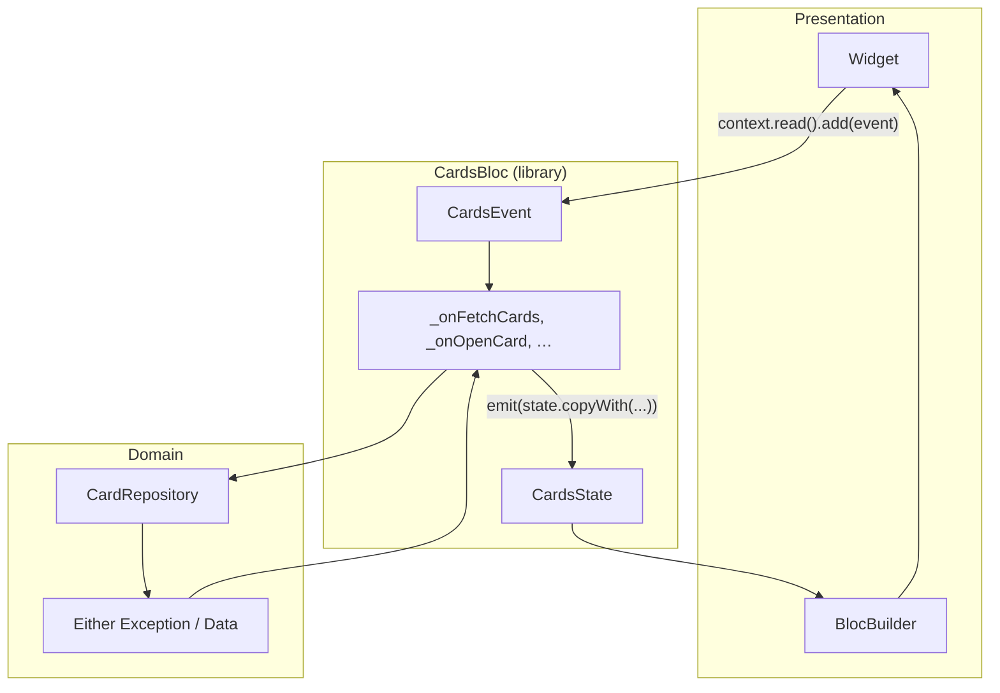

# BLoC Architecture — Feature Bloc Pattern

Guide for working with BLoC in this project. Uses `CardsBloc` as the reference implementation; the same rules apply across features (`settings`, `open_card`, `add_new_card`, etc.).

---

## Overview

Each feature bloc is a **Dart library** split into three files: the bloc class, events, and state. The bloc receives dependencies via constructor injection, handles events through typed handlers, and emits immutable state. UI reads state with `BlocBuilder` and dispatches events with `context.read<Bloc>().add(...)`.

| Layer | Location | Responsibility |
|-------|----------|----------------|
| Bloc root | `bloc/<feature>_bloc.dart` | Class, handlers, mixins, repository calls |
| Events | `bloc/<feature>_event.dart` | `part of` bloc — user/system actions |
| State | `bloc/<feature>_state.dart` | `part of` bloc — immutable snapshot + getters |
| Repositories | `domain/repositories/` | Data access, returns `Either<Exception, T>` |
| UI | `presentation/` | `BlocBuilder`, `context.read`, optional local `BlocProvider` |



---

## Reference: `CardsBloc` structure

### Folder layout

```
lib/features/home/
├── bloc/
│   ├── BLOC_ARCHITECTURE.md    # this file
│   ├── cards_bloc.dart         # library root
│   ├── cards_event.dart        # part of cards_bloc.dart
│   └── cards_state.dart        # part of cards_bloc.dart
└── presentation/
    └── home_screen.dart        # consumes CardsBloc
```

### Three-file library pattern

```dart
// cards_bloc.dart — library root
import 'package:bloc/bloc.dart';
import 'package:equatable/equatable.dart';
// repositories, mixins, services

part 'cards_event.dart';
part 'cards_state.dart';

class CardsBloc extends Bloc<CardsEvent, CardsState>
    with EventTransformerMixin, ShowSnackBarMixin {
  // dependencies, constructor, on<Event> registrations, handlers
}
```

```dart
// cards_event.dart
part of 'cards_bloc.dart';

sealed class CardsEvent extends Equatable { /* ... */ }
class CardsFetchCardsEvent extends CardsEvent {}
```

```dart
// cards_state.dart
part of 'cards_bloc.dart';

final class CardsState extends Equatable {
  // fields, copyWith, computed getters, props
}
```

**Why this structure?**

- Events and state share the bloc's import scope — no duplicate imports in part files.
- One import for UI: `import '.../cards_bloc.dart';` gives access to bloc, events, and state.
- Handlers stay in the main file; event/state definitions stay focused and scannable.

---

## Events

### Base class and naming

```dart
sealed class CardsEvent extends Equatable {
  const CardsEvent();
  @override
  List<Object?> get props => [];
}
```

| Rule | Convention |
|------|------------|
| Base class | `sealed class <Feature>Event extends Equatable` |
| Event classes | `<Feature><Action>Event` — e.g. `CardsFetchCardsEvent`, `CardsOpenCardEvent` |
| File | `<feature>_event.dart`, `part of '<feature>_bloc.dart'` |
| Equality | Override `props` with all fields **except** `Completer` and `BuildContext` |

### Event payload patterns

**Simple trigger** — no fields:

```dart
class CardsFetchCardsEvent extends CardsEvent {}
```

**Data payload** — fields passed from UI:

```dart
class CardsSearchEvent extends CardsEvent {
  final String? text;
  const CardsSearchEvent(this.text);
  @override
  List<Object?> get props => [text];
}
```

**Async result back to UI** — `Completer` on the event:

```dart
class CardsOpenCardEvent extends CardsEvent {
  final int? id;
  final int index;
  final Completer<DataBaseCard> completer;

  const CardsOpenCardEvent({
    required this.id,
    required this.index,
    required this.completer,
  });

  @override
  List<Object?> get props => [id, index]; // completer excluded
}
```

UI usage:

```dart
void onPressed(BuildContext context) {
  final completer = Completer<DataBaseCard>();
  context.read<CardsBloc>().add(
    CardsOpenCardEvent(id: card?.id, index: currentIndex, completer: completer),
  );
  completer.future.then((curCard) => CardOpenSheet.show(context, curCard));
}
```

Handler completes or fails the completer:

```dart
result.fold(
  (Exception e) {
    showSnackBar(e.message);
    event.completer.completeError(e);
  },
  (DataBaseCard card) {
    emit(state.copyWith(currentCard: card, cards: cards));
    event.completer.complete(card);
  },
);
```

**UI context for platform actions** — `BuildContext` when share sheets need it:

```dart
class CardsShareFileEvent extends CardsEvent {
  final BuildContext ctx;
  const CardsShareFileEvent(this.ctx);
  @override
  List<Object?> get props => []; // context excluded from equality
}
```

> `BuildContext` and `Completer` are intentionally omitted from `props` — they are not value-equatable and should not trigger duplicate-event deduplication.

---

## State

### Immutable snapshot with `copyWith`

```dart
final class CardsState extends Equatable {
  const CardsState({
    this.isLoading = false,
    this.cards = const [],
    this.searchListCards = const [],
    this.currentCard,
    this.error,
  });

  final bool isLoading;
  final List<DataBaseCard> cards;
  final List<DataBaseCard> searchListCards;
  final DataBaseCard? currentCard;
  final Object? error;

  CardsState copyWith({ /* nullable overrides */ }) { /* ... */ }

  @override
  List<Object?> get props => [cards, currentCard, searchListCards, isLoading, error];
}
```

| Rule | Convention |
|------|------------|
| Class | `final class <Feature>State extends Equatable` |
| Fields | `final`, defaults in constructor |
| Updates | Always `emit(state.copyWith(...))` — never mutate fields in place |
| Lists | Replace with new lists: `[...state.cards, card]` or `.where(...).toList()` |
| Computed values | Getters on state, not duplicated in UI |

### Computed getter example

Search keeps two lists — full `cards` and filtered `searchListCards`. UI reads one getter:

```dart
List<DataBaseCard> get getCardsBySearch =>
    searchListCards.isNotEmpty ? searchListCards : cards;
```

```dart
// home_screen.dart
BlocBuilder<CardsBloc, CardsState>(
  builder: (context, state) {
    return _GridCards(cards: state.getCardsBySearch);
  },
)
```

### Bloc-level getters

Read-only helpers that depend on current state can live on the bloc:

```dart
bool get isCurrentCardQr =>
    state.currentCard?.cardCodeType == CardCodeType.qr;
```

---

## Handlers

### Registration

Register all handlers in the bloc constructor:

```dart
CardsBloc({ required CardRepository cardRepo, /* ... */ })
    : _cardRepo = cardRepo,
      super(CardsState()) {
  on<CardsFetchCardsEvent>(_onFetchCards);
  on<CardsOpenCardEvent>(_onOpenCard);
  on<CardsSearchEvent>(_onCardSearch, transformer: debounceRestartable());
  // ...
}
```

### Handler shape

Every async handler follows the same flow:

1. `emit(state.copyWith(isLoading: true))` (when loading matters)
2. Call repository / service
3. Handle result with `.fold()`
4. `emit` final state; show snackbar or complete completer on error

```dart
_onFetchCards(CardsFetchCardsEvent event, Emitter<CardsState> emit) async {
  emit(state.copyWith(isLoading: true));

  final cards = await _cardRepo.getCards();

  cards.fold(
    (Exception e) {
      if (e is LocalDataBaseException) {
        emit(state.copyWith(cards: state.cards, isLoading: false, error: e));
        showSnackBar(e.message, useDelay: true);
      }
    },
    (List<DataBaseCard> cards) =>
        emit(state.copyWith(cards: cards, isLoading: false)),
  );
}
```

| Topic | Convention |
|-------|------------|
| Handler names | Private: `_onFetchCards`, `_onOpenCard` |
| Visibility | Handlers are private methods on the bloc class |
| Error handling | Pattern-match exception type (`if (e is LocalDataBaseException)`) |
| Loading flag | Set `isLoading: true` at start, `false` in every branch |
| State on error | Preserve existing data: `cards: state.cards` |

### Chaining events from the bloc

When one action produces data that triggers another event, dispatch internally:

```dart
void addCardFromData(Map<String, dynamic> cardMap, { Completer<DataBaseCard>? completer }) {
  cardMap.forEach((key, card) => add(
    CardsAddCardEvent(/* ... */, completer: cardMap.keys.last == key ? completer : null),
  ));
}
```

Also used from `MyApp` when deep links deliver JSON:

```dart
bloc.addCardFromData(state.jsonData);
```

---

## Event transformers

High-frequency events (search, text input) use debounced restartable processing via `EventTransformerMixin`:

```dart
// common/mixins/event_transformer_mixin.dart
mixin EventTransformerMixin {
  EventTransformer<E> debounceRestartable<E>() {
    return (events, mapper) => restartable<E>().call(
      events.debounceTime(const Duration(milliseconds: 300)),
      mapper,
    );
  }
}
```

Usage:

```dart
on<CardsSearchEvent>(_onCardSearch, transformer: debounceRestartable());
```

| When to use | Transformer |
|-------------|-------------|
| Search, text field changes | `debounceRestartable()` |
| Fetch, create, delete, share | Default (sequential) |

Same pattern in `OpenCardBloc` and `CreateCardBloc` for code/name/search fields.

---

## Mixins

### `ShowSnackBarMixin`

User-facing errors from the bloc show a snackbar after the frame:

```dart
mixin ShowSnackBarMixin {
  Future<void> showSnackBar(String message, {bool useDelay = false}) async =>
      WidgetsBinding.instance.addPostFrameCallback((_) {
        AnimatedSnackBar.show(message: message);
      });
}
```

Used in `CardsBloc` after repository failures. Keeps UI feedback out of widgets for error paths triggered by bloc logic.

### `EventTransformerMixin`

Shared debounce/restartable transformers — see above.

---

## Repository layer and `Either`

Blocs do not call services directly. They depend on repository interfaces that return `Either<Exception, T>` from `dartz`:

```dart
abstract class CardRepository {
  Future<Either<Exception, List<DataBaseCard>>> getCards();
  Future<Either<Exception, DataBaseCard>> createCard({ /* ... */ });
}
```

Repositories wrap service calls with `ErrorHandlerMixin.safeCall`:

```dart
Future<Either<Exception, T>> safeCall<T>(Future<T> Function() action) async {
  try {
    return Right(await action());
  } on LocalDataBaseException catch (e) {
    return Left(LocalDataBaseErrorMessageResolver.withResolvedMessage(e));
  } catch (e) {
    return Left(e as Exception);
  }
}
```

**Bloc rule:** always branch with `.fold((left) { ... }, (right) { ... })` — do not try/catch around repository calls in handlers unless converting to a new event.

---

## Dependency injection and lifecycle

### App-wide blocs (`main.dart`)

`CardsBloc` and `SettingsBloc` are created once at app startup:

```dart
BlocProvider(
  lazy: false,
  create: (_) => CardsBloc(
    cardRepo: diContainer.makeCardRepository(),
    imageConvertHelper: diContainer.makeConverterHelper(),
    shareRepository: diContainer.makeShareRepository(),
    filePickRepository: diContainer.makeFilePickRepository(),
  )..add(CardsFetchCardsEvent()),
),
```

| Rule | Convention |
|------|------------|
| Global feature blocs | `BlocProvider` in `main.dart` with `lazy: false` |
| Initial event | Chain with `..add(FetchEvent())` in `create` |
| Repositories | Injected via `DiContainer`, not instantiated in bloc |
| Scoped blocs | `BlocProvider` at sheet/route level |

### Scoped blocs (sheet-level)

`OpenCardBloc` is created when a bottom sheet opens — scoped to that sheet's widget tree:

```dart
showModalBottomSheet(
  builder: (context) {
    return BlocProvider(
      create: (context) => OpenCardBloc(
        brightnessService: context.read<BrightnessService>(),
      )..add(OpenCardInitEvent(curCard, brightnessMode)),
      child: CardOpenSheet(curCard),
    );
  },
);
```

`CreateCardBloc` follows the same pattern inside add-card sheets.

**Coordination between blocs:** sheet UI reads both scoped and global blocs:

```dart
final cardsBloc = context.read<CardsBloc>();   // global — persist changes
final openBloc = context.read<OpenCardBloc>(); // local — edit form state

cardsBloc.add(CardsUpdateCardEvent(/* from openBloc.state */));
```

---

## UI integration

### Dispatch events

```dart
context.read<CardsBloc>().add(CardsSearchEvent(value));
```

Use `context.read` in callbacks — not in `build()` directly unless wrapped in a closure.

### Rebuild on state changes

```dart
BlocBuilder<CardsBloc, CardsState>(
  builder: (context, state) {
    return _GridCards(cards: state.getCardsBySearch);
  },
)
```

Optional fine-grained rebuilds:

```dart
BlocBuilder<SettingsBloc, SettingsState>(
  buildWhen: (prev, cur) => prev.theme != cur.theme,
  builder: (context, state) => /* ... */,
)
```

### Listen for side effects (app level)

```dart
BlocListener<AppCubit, AppState>(
  listenWhen: (prev, cur) => prev.jsonData != cur.jsonData,
  listener: (context, state) {
    context.read<CardsBloc>().addCardFromData(state.jsonData);
  },
  child: /* ... */,
)
```

Use `BlocListener` when navigation, snackbars, or cross-bloc coordination should happen once per state change — not inside `BlocBuilder`.

---

## Bloc types in this project

| Bloc | Scope | Role |
|------|-------|------|
| `CardsBloc` | App-wide | Card list CRUD, search, share, import |
| `SettingsBloc` | App-wide | Theme, locale, brightness, settings search |
| `OpenCardBloc` | Sheet | Edit form state while viewing a card |
| `CreateCardBloc` | Sheet | Scanner, template picker, new card form |
| `AppCubit` | App-wide | Deep links, app-level messages |

Naming note: create flow uses `CreateCardBloc` / `CreateCardEvent` (not `AddCardBloc`).

---

## Adding a new feature handler — step by step

### Step 1 — Define the event

In `cards_event.dart`:

```dart
class CardsDuplicateCardEvent extends CardsEvent {
  final int id;
  const CardsDuplicateCardEvent(this.id);
  @override
  List<Object?> get props => [id];
}
```

### Step 2 — Extend state (if needed)

In `cards_state.dart`, add fields and update `copyWith` / `props`.

### Step 3 — Register handler

In `CardsBloc` constructor:

```dart
on<CardsDuplicateCardEvent>(_onDuplicateCard);
```

### Step 4 — Implement handler

```dart
Future<void> _onDuplicateCard(
  CardsDuplicateCardEvent event,
  Emitter<CardsState> emit,
) async {
  emit(state.copyWith(isLoading: true));
  final result = await _cardRepo.duplicateCard(id: event.id);
  result.fold(
    (e) { /* emit error state, showSnackBar */ },
    (card) => emit(state.copyWith(cards: [...state.cards, card], isLoading: false)),
  );
}
```

### Step 5 — Wire UI

```dart
context.read<CardsBloc>().add(CardsDuplicateCardEvent(cardId));
```

### Step 6 — Add repository method (if needed)

Extend `CardRepository` + `CardRepositoryImpl` with `Either`-based API before calling from the bloc.

---

## Anti-patterns

| Avoid | Do instead |
|-------|------------|
| Mutating `state.cards.add(...)` | `emit(state.copyWith(cards: [...state.cards, card]))` |
| Importing in `cards_event.dart` / `cards_state.dart` | Keep imports in bloc root only |
| Putting `Completer` in `props` | Exclude non-equatable runtime objects |
| Calling `CardService` from bloc | Inject and call `CardRepository` |
| Business logic in `BlocBuilder` | Move to bloc handler or state getter |
| Creating `CardsBloc` inside a widget | Provide at app root or sheet scope |
| Ignoring left branch of `Either` | Always handle errors — emit + snackbar |
| `emit` after bloc is closed | Guard with `isClosed` if async gap is long (rare here) |

---

## Quick checklist

Before opening a PR on a bloc change:

- [ ] Event class added to `*_event.dart` with correct `props`
- [ ] State updated with `copyWith` and `props` if new fields added
- [ ] Handler registered in constructor
- [ ] Repository returns `Either`; handler uses `.fold()`
- [ ] `isLoading` cleared in every branch
- [ ] Errors show snackbar or complete completer with error
- [ ] High-frequency events use `debounceRestartable()` where appropriate
- [ ] UI dispatches via `context.read<Bloc>().add(...)`
- [ ] No direct service calls from bloc — repositories only

---

## Quick reference

```dart
// Imports (UI)
import 'package:card_holder/features/home/bloc/cards_bloc.dart';

// Dispatch
context.read<CardsBloc>().add(CardsFetchCardsEvent());

// Async result
final completer = Completer<DataBaseCard>();
context.read<CardsBloc>().add(CardsOpenCardEvent(id: id, index: i, completer: completer));
await completer.future;

// Rebuild
BlocBuilder<CardsBloc, CardsState>(
  builder: (context, state) => Text('${state.cards.length}'),
)

// Bloc library root
part 'cards_event.dart';
part 'cards_state.dart';

class CardsBloc extends Bloc<CardsEvent, CardsState> with EventTransformerMixin {
  CardsBloc({ required CardRepository cardRepo }) : _cardRepo = cardRepo, super(const CardsState()) {
    on<CardsFetchCardsEvent>(_onFetchCards);
  }
}
```
