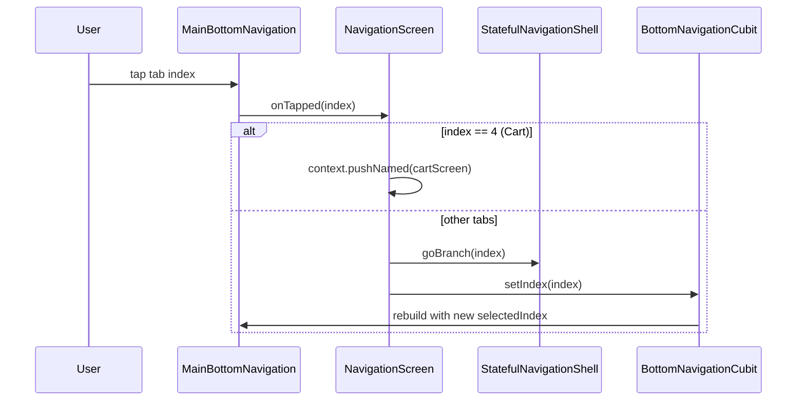
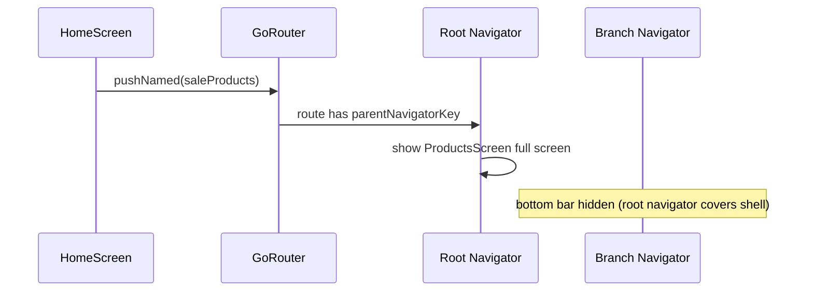

# Main Router Architecture

This document describes how bottom navigation and routing work in this project, centered on `lib/routers/main/main_router.dart`. Use it as a reference when setting up the same pattern in a new Flutter app.

## Overview

The app uses **[go_router](https://pub.dev/packages/go_router)** (`^16.2.4`) with a **`StatefulShellRoute.indexedStack`**. Each bottom tab is a **shell branch** with its own navigation stack. A shared **`NavigationScreen`** wraps all tabs and renders the bottom bar.

```
MaterialApp.router
└── GoRouter (AppRouter.mainRouter)
    ├── StatefulShellRoute.indexedStack  ← authenticated app shell
    │   └── NavigationScreen
    │       ├── body: StatefulNavigationShell (active branch stack)
    │       └── bottomNavigationBar: MainBottomNavigation
    │           ├── branch 0: Home        (/)
    │           ├── branch 1: Services    (/services)
    │           ├── branch 2: Leftovers   (/leftovers)
    │           ├── branch 3: Selections  (/selections)
    │           ├── branch 4: Cart        (/cart) — special case
    │           └── branch 5: Profile     (/profile)
    └── GoRoute /login                   ← outside the shell (no bottom bar)
```

## File Structure

```
lib/
├── app.dart                              # MaterialApp.router → AppRouter.mainRouter
├── main.dart                             # BlocProvider<BottomNavigationCubit>
├── routers/
│   └── main/
│       ├── main_router.dart              # GoRouter definition, root navigator key
│       └── branches/
│           ├── home_router.dart          # part of main_router.dart
│           ├── services_router.dart
│           ├── leftovers_router.dart
│           ├── selections_router.dart
│           ├── cart_router.dart
│           └── profile_router.dart
├── screens/
│   └── navigation/
│       └── navigation_screen.dart        # Shell scaffold + bottom bar
├── common/widgets/main_bottom_navigation/
│   ├── main_bottom_navigation.dart
│   └── main_bottom_navigation_button.dart
└── data/blocs/app_bottom_navigation/
    └── app_bottom_navigation_cubit.dart  # Selected tab index (UI state)
```

Branch files use Dart **`part` / `part of`** so they share imports and `_rootNavigatorKey` from `main_router.dart` without duplicating imports.

## Core Components

### 1. `AppRouter` — root router

Defined in `lib/routers/main/main_router.dart`.

| Piece | Role |
|-------|------|
| `_rootNavigatorKey` | Global key for the **root** navigator (full-screen routes) |
| `AppRouter.mainRouter` | Single `GoRouter` instance used by the app |
| `StatefulShellRoute.indexedStack` | Keeps each tab's stack alive when switching tabs |
| `NavigationScreen` | Shell builder: receives `StatefulNavigationShell child` |
| Branches spread | `...home()`, `...services`, `...leftovers`, etc. |

Initial location:

- Production: `/login` when not in check mode, otherwise `/`
- Login route redirects to `/` if already authenticated

### 2. Branch routers — one tab = one `StatefulShellBranch`

Each branch file exports a `List<StatefulShellBranch>` (or a function returning it).

Pattern inside every branch:

```dart
final List<StatefulShellBranch> services = [
  StatefulShellBranch(
    routes: [
      GoRoute(
        name: ServicesConst.services,   // route name for goNamed/pushNamed
        path: ServicesPath.services,      // absolute path: /services
        builder: (_, __) => const ServicesScreen(),
        routes: [
          GoRoute(
            name: ServicesConst.sales,
            path: ServicesConst.sales,  // relative: /services/sales
            parentNavigatorKey: _rootNavigatorKey,  // full-screen overlay
            builder: (_, state) => const SalesScreen(),
          ),
        ],
      ),
    ],
  ),
];
```

**Naming convention** (used consistently across branches):

| Class | Contains | Example |
|-------|----------|---------|
| `*Const` | Route **names** (for `goNamed` / `pushNamed`) | `ServicesConst.sales` → `'sales'` |
| `*Path` | Top-level **paths** (absolute, start with `/`) | `ServicesPath.services` → `'/services'` |
| Nested routes | Path segments relative to parent | `path: 'sale'` → `/services/sales/sale` |

### 3. `parentNavigatorKey: _rootNavigatorKey` — two navigator levels

Routes **without** `parentNavigatorKey` stay inside the **branch navigator** (tab stack). The bottom bar remains visible.

Routes **with** `parentNavigatorKey: _rootNavigatorKey` open on the **root navigator** — full screen, bottom bar hidden. Use this for detail screens, modals-as-pages, checkout flows, etc.

```
NavigationScreen (Scaffold + bottom bar)
└── Branch Navigator (e.g. Home tab)
    └── HomeScreen
        └── push → ProductsScreen (parentNavigatorKey) → covers entire screen
```

### 4. `NavigationScreen` — shell UI

`lib/screens/navigation/navigation_screen.dart` connects go_router shell API to the bottom bar.

On tab tap:

```dart
void setCurrentIndex(int index) {
  if (index == 4) {
    // Cart: open as root overlay, do not switch branch
    context.pushNamed(CartConst.cartScreen);
  } else {
    widget.child.goBranch(index);                        // go_router tab switch
    context.read<BottomNavigationCubit>().setIndex(index); // sync UI highlight
  }
}
```

Important details:

- **`goBranch(index)`** — switches the active shell branch (must match branch order in `main_router.dart`).
- **`BottomNavigationCubit`** — holds the highlighted tab index for `MainBottomNavigation`. go_router does not drive the bar directly; the cubit keeps UI in sync.
- **Cart (index 4)** is special: tapping it **pushes** the cart screen on the root navigator instead of switching to the cart branch (the cart branch root is `SizedBox.shrink()`).

Branch order in `main_router.dart` **must match** bottom bar item order:

| Index | Branch | Path | Label |
|-------|--------|------|-------|
| 0 | `home` | `/` | Главная |
| 1 | `services` | `/services` | Сервисы |
| 2 | `leftovers` | `/leftovers` | Остатки |
| 3 | `selections` | `/selections` | Подборки |
| 4 | `cart` | `/cart` | Корзина |
| 5 | `profile` | `/profile` | Профиль |

### 5. `BottomNavigationCubit`

Simple `Cubit<int>` storing the selected tab index. Provided at app root in `main.dart`:

```dart
BlocProvider<BottomNavigationCubit>(
  create: (_) => BottomNavigationCubit(),
  lazy: false,
),
```

Also updated from:

- Tab taps in `NavigationScreen`
- Logout in `ProfileCardScreen` (reset to `0`)
- Push notification deep links in `NotificationDeepLinkProvider`

### 6. `MainBottomNavigation`

Custom bottom bar widget (`lib/common/widgets/main_bottom_navigation/`). It is **presentation only** — it receives `selectedIndex` and `onTapped`; it does not know about go_router.

> Note: `AppBottomNavigationBar` in `lib/common/widgets/common/bottomNavigationBar/` is a **legacy** widget used in check/test mode, not the production shell bar.

### 7. App entry wiring

`lib/app.dart`:

```dart
MaterialApp.router(
  routerConfig: AppConfig.getCheckMode
      ? testRouter(remoteMessage)   // simplified 3-tab test router
      : AppRouter.mainRouter,
)
```

Check mode uses `lib/routers/test/test_router.dart` — same `NavigationScreen` + `StatefulShellRoute` pattern with fewer branches.

## Navigation API Usage

Screens import `main_router.dart` for route name constants, then use go_router extensions:

| Method | Behavior | Typical use |
|--------|----------|-------------|
| `context.goNamed(name)` | Replaces current location (no back stack within branch) | Tab root screens, menu items that should reset stack |
| `context.pushNamed(name, extra: data)` | Pushes onto current (or root) navigator | Detail screens, forms |
| `context.go('/')` | Navigate by path | Deep links |

Pass complex objects via **`extra`**:

```dart
context.pushNamed(ServicesConst.sale, extra: saleModel);
context.pushNamed(LeftoversConst.product, extra: product, queryParameters: {'inStock': 'true'});
```

## Flow Diagrams

### Tab switch



### Push detail screen (full screen)



## How to Implement in a New Project

### Step 1 — Dependencies

```yaml
dependencies:
  go_router: ^16.2.4
  flutter_bloc: ^8.0.0   # optional but matches this project
```

### Step 2 — Root navigator key and main router

Create `lib/routers/main/main_router.dart`:

```dart
import 'package:flutter/material.dart';
import 'package:go_router/go_router.dart';
import 'package:my_app/screens/navigation/navigation_screen.dart';
import 'package:my_app/screens/home/home_screen.dart';
import 'package:my_app/screens/settings/settings_screen.dart';

part 'branches/home_router.dart';
part 'branches/settings_router.dart';

final GlobalKey<NavigatorState> _rootNavigatorKey = GlobalKey<NavigatorState>();

abstract class AppRouter {
  static GoRouter router = GoRouter(
    navigatorKey: _rootNavigatorKey,
    initialLocation: '/',
    routes: [
      StatefulShellRoute.indexedStack(
        builder: (context, state, child) => NavigationScreen(child: child),
        branches: [
          ...homeBranch,
          ...settingsBranch,
        ],
      ),
    ],
  );
}
```

### Step 3 — One branch file per tab

`lib/routers/main/branches/home_router.dart`:

```dart
part of '../main_router.dart';

abstract class HomeConst {
  static const home = 'home';
  static const details = 'home-details';
}

abstract class HomePath {
  static const home = '/';
}

final List<StatefulShellBranch> homeBranch = [
  StatefulShellBranch(
    routes: [
      GoRoute(
        name: HomeConst.home,
        path: HomePath.home,
        builder: (_, __) => const HomeScreen(),
        routes: [
          GoRoute(
            name: HomeConst.details,
            path: 'details',
            parentNavigatorKey: _rootNavigatorKey,
            builder: (_, state) => DetailsScreen(id: state.extra as String),
          ),
        ],
      ),
    ],
  ),
];
```

Repeat for each tab with its own top-level path (`/settings`, `/profile`, etc.).

### Step 4 — Navigation shell screen

```dart
class NavigationScreen extends StatelessWidget {
  const NavigationScreen({super.key, required this.child});

  final StatefulNavigationShell child;

  void _onTap(BuildContext context, int index) {
    child.goBranch(index);
    context.read<BottomNavigationCubit>().setIndex(index);
  }

  @override
  Widget build(BuildContext context) {
    return BlocBuilder<BottomNavigationCubit, int>(
      builder: (context, selectedIndex) {
        return Scaffold(
          body: child,
          bottomNavigationBar: NavigationBar(
            selectedIndex: selectedIndex,
            onDestinationSelected: (index) => _onTap(context, index),
            destinations: const [
              NavigationDestination(icon: Icon(Icons.home), label: 'Home'),
              NavigationDestination(icon: Icon(Icons.settings), label: 'Settings'),
            ],
          ),
        );
      },
    );
  }
}
```

### Step 5 — Wire `MaterialApp.router`

```dart
MaterialApp.router(
  routerConfig: AppRouter.router,
)
```

### Step 6 — Provide tab index state

```dart
runApp(
  BlocProvider(
    create: (_) => BottomNavigationCubit(),
    child: const MyApp(),
  ),
);
```

### Step 7 — Navigate from screens

```dart
// Stay in branch, replace stack
context.goNamed(HomeConst.home);

// Open full-screen detail
context.pushNamed(HomeConst.details, extra: itemId);
```

## Adding a New Bottom Tab

1. Create `lib/routers/main/branches/my_tab_router.dart` with `StatefulShellBranch` and `*Const` / `*Path` classes.
2. Add `part 'branches/my_tab_router.dart';` to `main_router.dart`.
3. Insert `...myTab` in the `branches:` list at the desired index.
4. Add a matching item in `NavigationScreen` → `MainBottomNavigation` `items` list **at the same index**.
5. If deep links or notifications should highlight the tab, update `NotificationDeepLinkProvider.setAppBottomBarIndex`.

## Adding Routes to an Existing Tab

1. Add a name constant to the branch's `*Const` class.
2. Add a nested `GoRoute` under the tab's root route.
3. Use `parentNavigatorKey: _rootNavigatorKey` if the screen should hide the bottom bar.
4. Navigate with `context.goNamed(...)` or `context.pushNamed(...)` from the screen.

## Auth / Routes Outside the Shell

Login lives **outside** `StatefulShellRoute` so it has no bottom bar:

```dart
GoRoute(
  name: MainConst.login,
  path: MainPath.login,
  redirect: (_, __) => appService.isAuth ? '/' : null,
  builder: (_, __) => const LoginScreen(),
),
```

After login: `context.goNamed(HomeRoutes.homePage)`.

After logout: reset cubit index and `context.goNamed('login')`.

## Special Patterns in This Project

### Cart as overlay tab

The cart branch exists for route naming and deep links, but the visible cart opens via `pushNamed` on the root navigator. The branch root renders `SizedBox.shrink()`.

Use this when a tab should feel like a modal overlay rather than a persistent stack.

### `part` files for scale

With 6 branches and hundreds of nested routes, splitting into `part` files keeps `main_router.dart` readable while sharing one import block and `_rootNavigatorKey`.

### Test / check mode router

`lib/routers/test/test_router.dart` reuses `NavigationScreen` with 3 branches. Same architecture, smaller route set — useful for UI review builds.

### Deep links from push notifications

`NotificationDeepLinkProvider`:

1. Maps route name → bottom bar index.
2. Calls `BottomNavigationCubit.setIndex`.
3. Calls `context.goNamed(route)`.

When adding notification targets, update the `switch` mapping so the correct tab is highlighted.

## Checklist for a New Project

- [ ] `go_router` added; `MaterialApp.router` configured
- [ ] `_rootNavigatorKey` created once, shared via `part` files
- [ ] `StatefulShellRoute.indexedStack` with one branch per tab
- [ ] Branch order matches bottom bar item order
- [ ] `NavigationScreen` calls `child.goBranch(index)` on tab change
- [ ] `BottomNavigationCubit` (or equivalent) syncs selected tab UI
- [ ] Full-screen routes use `parentNavigatorKey: _rootNavigatorKey`
- [ ] Route names centralized in `*Const` classes; paths in `*Path` classes
- [ ] Auth / onboarding routes placed outside the shell
- [ ] Screens navigate via `goNamed` / `pushNamed`, not hardcoded path strings

## Key Source References

| File | Responsibility |
|------|----------------|
| `lib/routers/main/main_router.dart` | Router assembly, shell route, login |
| `lib/routers/main/branches/*.dart` | Per-tab route trees |
| `lib/screens/navigation/navigation_screen.dart` | Scaffold + tab switching logic |
| `lib/common/widgets/main_bottom_navigation/` | Bottom bar UI |
| `lib/data/blocs/app_bottom_navigation/app_bottom_navigation_cubit.dart` | Tab highlight state |
| `lib/app.dart` | Router injection into `MaterialApp` |
| `lib/data/providers/notification_deeplink_provider/` | Deep link + tab sync |
