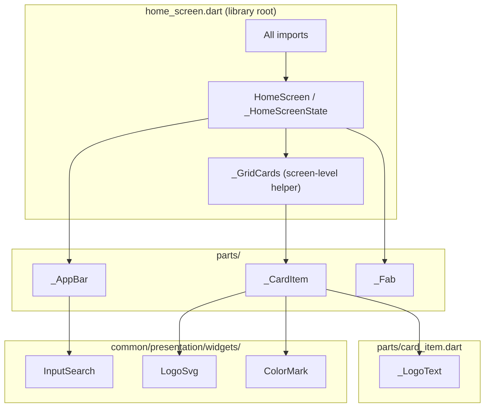

# Widget Refactoring — Screen Parts Pattern

Guide for splitting Flutter screens into focused widget parts. Uses `HomeScreen` as the reference implementation; the same rules apply across features (`settings`, `open_card`, `add_new_card`, etc.).

---

## Overview

Large screens are split into a **library root** (the main screen file) and **part files** under a `parts/` folder. The main file owns imports and screen orchestration; part files hold private widgets that compose the UI.

| Layer | Location | Responsibility |
|-------|----------|----------------|
| Screen root | `presentation/<screen>.dart` | Imports, `part` directives, screen widget, lifecycle, Bloc wiring |
| Screen parts | `presentation/parts/*.dart` | Private sub-widgets (`_AppBar`, `_CardItem`, …) |
| Nested parts | `presentation/parts/<group>/parts/*.dart` | Sub-widgets of a larger part (optional, deeper screens) |
| Shared widgets | `common/presentation/widgets/` | Reusable across features (buttons, inputs, logos) |



---

## Reference: `HomeScreen` structure

### Folder layout

```
lib/features/home/presentation/
├── WIDGET_REFACTORING.md       # this file
├── home_screen.dart            # library root
└── parts/
    ├── app_bar.dart
    ├── card_item.dart
    └── fab.dart
```

### Main file — orchestration only

`home_screen.dart` does four things:

1. Declares all imports (parts do not import packages).
2. Declares `part` directives for each part file.
3. Holds the screen widget and its `State` (lifecycle: `TabController`, `initState`, `dispose`).
4. Composes the tree in `build()` — wires Bloc, passes controllers, delegates UI to parts.

```dart
// home_screen.dart — library root
part 'parts/app_bar.dart';
part 'parts/card_item.dart';
part 'parts/fab.dart';

class HomeScreen extends StatefulWidget { /* ... */ }

class _HomeScreenState extends State<HomeScreen> with TickerProviderStateMixin {
  late final TabController _tabController;

  @override
  Widget build(BuildContext context) {
    return Scaffold(
      floatingActionButton: const _Fab(),
      body: NestedScrollView(
        headerSliverBuilder:
            (context, innerBoxIsScrolled) => [_AppBar(_tabController)],
        body: TabBarView(
          controller: _tabController,
          children: [
            BlocBuilder<CardsBloc, CardsState>(
              builder: (context, state) {
                return _GridCards(cards: state.getCardsBySearch);
              },
            ),
            const SettingsPage(),
          ],
        ),
      ),
    );
  }
}
```

**What stays in the main file:**

- `StatefulWidget` state and controllers.
- Top-level `BlocBuilder` / `BlocListener` that decide *what* to show.
- Thin screen-level helpers (e.g. `_GridCards`) when they are mostly layout glue, not a full UI section.

### Part file — one UI section

Each part is a private widget focused on a single visual area:

| Part file | Widget | Role |
|-----------|--------|------|
| `app_bar.dart` | `_AppBar` | Title, search field, tab bar |
| `card_item.dart` | `_CardItem`, `_LogoText` | Single grid cell + fallback text logo |
| `fab.dart` | `_Fab` | Add-card floating action button |

```dart
// parts/fab.dart
part of '../home_screen.dart';

class _Fab extends StatelessWidget {
  const _Fab();

  @override
  Widget build(BuildContext context) {
    return Container(
      key: const Key('home_add_button'),
      decoration: fabDecor(context),
      child: TextButton(
        onPressed: () => TemplateCardSheet.show(context),
        child: Text(t.screen.home.add, style: context.textStyles.labelSmall),
      ),
    );
  }
}
```

---

## How `part` / `part of` works

```dart
// home_screen.dart — library root
import 'package:flutter/material.dart';
// ... all other imports

part 'parts/app_bar.dart';
part 'parts/card_item.dart';
part 'parts/fab.dart';
```

```dart
// parts/app_bar.dart
part of '../home_screen.dart';

class _AppBar extends StatelessWidget { /* uses imports from main file */ }
```

**Why this structure?**

- **Single import surface** — parts share the main file's scope; no duplicate imports.
- **Private by default** — part widgets use `_` prefix and are not exported elsewhere.
- **Small files** — each part stays under ~100 lines; easy to scan and review.
- **One library** — analyzer treats all parts as one compilation unit; private members are visible across parts.

---

## When to extract a widget

### Extract to a `parts/` file when

- The widget is a **distinct UI section** (app bar, list item, FAB, sheet section).
- The widget has **its own build logic** (decorations, gestures, conditional children).
- The widget handles **local interaction** (tap → dispatch Bloc event, open sheet).
- The extracted code would make the main file **harder to read** (> ~100 lines total or a dense `build()`).

### Keep in the main screen file when

- It is **orchestration**: `BlocBuilder`, `TabBarView`, `NestedScrollView` wiring.
- It is a **thin layout wrapper** with no reusable identity (e.g. `_GridCards` — grid config + empty state).
- It needs **direct access to `State`** fields — pass them as constructor params instead of moving `State` into parts.

### Move to `common/presentation/widgets/` when

- The widget is **reused in 2+ features** (`InputSearch`, `LogoSvg`, `ColorMark`, `DefaultButton`).
- The widget has **no feature-specific Bloc** dependencies (or accepts callbacks instead).

### Use a standalone import (not `part`) when

- The widget is **large and self-contained** but still feature-local.
- It needs to be imported from **multiple screen libraries** within the same feature.

Example: `from_developer_sheet.dart` is a normal import in `settings_screen.dart`, not a `part`, because it is a full sheet with its own scope.

---

## Naming and visibility rules

| Topic | Convention |
|-------|------------|
| Screen widget | Public: `HomeScreen`, `SettingsPage`, `CardOpenSheet` |
| Part widgets | Private: `_AppBar`, `_CardItem`, `_Fab` |
| Nested helpers | Private in the same part file: `_LogoText` inside `card_item.dart` |
| Part files | snake_case matching widget purpose: `app_bar.dart`, `card_item.dart` |
| Part directive | `part 'parts/<name>.dart';` relative to main file |
| Part of | `part of '../home_screen.dart';` — path to library root |
| Keys for tests | On interactive widgets: `key: const Key('home_add_button')` |

---

## Passing data and events

### Controllers and state from the screen

Pass dependencies through constructors — parts do not own screen-level lifecycle:

```dart
// Main file creates TabController
_AppBar(_tabController)

// Part receives it
class _AppBar extends StatelessWidget {
  const _AppBar(this._tabController);
  final TabController _tabController;
}
```

### Bloc access

Parts read and dispatch via `context` — no Bloc passed as a parameter:

```dart
context.read<CardsBloc>().add(CardsSearchEvent(value));
```

Keep `BlocProvider` / `BlocBuilder` at the orchestration level in the main file when they switch entire tabs or pages. Use `context.read` inside parts for localized actions (search, tap, FAB).

### Async callbacks

Use `Completer` or callbacks when the Bloc must return data to the UI:

```dart
void onPressed(BuildContext context) {
  final completer = Completer<DataBaseCard>();
  context.read<CardsBloc>().add(
    CardsOpenCardEvent(id: card?.id, completer: completer),
  );
  completer.future.then((curCard) => CardOpenSheet.show(context, curCard));
}
```

---

## Nested parts (deeper screens)

For complex features, group parts in subfolders. `CardOpenSheet` and `SettingsPage` use two levels:

```
open_card/presentation/
├── card_open_sheet.dart
└── parts/
    ├── choose_share_sheet.dart
    ├── logo_or_color_badge.dart
    └── show_barcode/
        ├── show_barcode.dart
        └── parts/
            ├── brightness_switcher.dart
            └── delete_button/
                ├── delete_button.dart
                └── delete_sheet.dart

settings/presentation/
├── screens/settings_screen.dart
└── parts/flip_card/
    ├── flip_card.dart
    ├── card_tab.dart
    └── parts/
        ├── choose_theme.dart
        └── choose_lang.dart
```

Rules for nesting:

- Each **library root** still has one main file with `part` directives.
- Subfolder `parts/` holds children of a logical group (`show_barcode`, `flip_card`).
- Prefer **flat part names** at the first level; nest only when a section has 3+ sub-widgets.

---

## Refactoring workflow

Use this checklist when splitting an existing monolithic screen.

### Step 1 — Identify sections

Mark distinct regions in `build()`:

- App bar / header
- Primary content (list, grid, form)
- FAB / bottom bar
- Modals and sheets (often separate files already)

### Step 2 — Create the parts folder

```
presentation/
├── my_screen.dart
└── parts/
```

### Step 3 — Extract one section at a time

1. Create `parts/<section>.dart` with `part of '../my_screen.dart';`.
2. Move the widget class into the part file; rename to `_SectionName`.
3. Add `part 'parts/<section>.dart';` to the main file.
4. Replace inline code in `build()` with `const _SectionName(...)` or `_SectionName(...)`.
5. Run analyzer — fix missing params; do not add imports to the part file.

### Step 4 — Decide what stays in main

After extraction, the main `build()` should read like an outline:

```dart
return Scaffold(
  floatingActionButton: const _Fab(),
  body: NestedScrollView(
    headerSliverBuilder: (_, __) => [_AppBar(_tabController)],
    body: TabBarView(/* tabs */),
  ),
);
```

### Step 5 — Split oversized parts

If a part file exceeds ~100 lines:

- Extract **nested private widgets** in the same file (`_LogoText` in `card_item.dart`).
- Or create a **subfolder** with nested parts (`show_barcode/parts/`).

### Step 6 — Promote to common widgets (optional)

If the same widget appears in another feature, move it to `common/presentation/widgets/<name>/` and import it from the main screen file.

---

## Widget type preferences

| Situation | Prefer |
|-----------|--------|
| No local state | `StatelessWidget` with `const` constructor |
| Screen-level tabs, animation | `StatefulWidget` in main file only |
| List/grid cell | `StatelessWidget` part |
| Reused across app | `StatelessWidget` in `common/presentation/widgets/` |

Follow project rules: Material 3, named parameters, trailing commas in multiline Dart, documentation on public APIs only (parts are private).

---

## Real examples in this repo

| Screen | Main file | Parts |
|--------|-----------|-------|
| Home | `home/presentation/home_screen.dart` | `app_bar`, `card_item`, `fab` |
| Settings | `settings/presentation/screens/settings_screen.dart` | `flip_card/*`, nested `choose_*` |
| Open card | `open_card/presentation/card_open_sheet.dart` | `show_barcode/*`, `choose_share_sheet` |
| Add card | `add_new_card/presentation/template_card_sheet/template_card_sheet.dart` | `shop_template_list`, `floppy_disk_container`, … |

---

## Anti-patterns

| Avoid | Do instead |
|-------|------------|
| Importing packages in part files | Keep all imports in the library root |
| Public widgets in `parts/` without reason | Use `_PrivateName` |
| Moving `BlocProvider` into every part | Provide at route/sheet level; `context.read` in parts |
| One giant part file for the whole screen | Split by visual section |
| Duplicating `InputSearch`-like widgets per feature | Use `common/presentation/widgets/` |
| Extracting a 5-line `Padding` wrapper | Keep inline in parent `build()` |

---

## Quick checklist

Before opening a PR on a refactored screen:

- [ ] Main file has all imports and `part` directives
- [ ] Each part starts with `part of '<main_file>.dart';`
- [ ] Part widgets are private (`_` prefix)
- [ ] Main `build()` is an readable outline (~30–50 lines)
- [ ] Each part file is under ~100 lines
- [ ] Controllers / `TickerProvider` stay in main `State`
- [ ] Shared widgets live in `common/`, not copied into parts
- [ ] `const` constructors used where possible
- [ ] Trailing commas on multiline parameter lists and calls

---

## Quick reference

```dart
// Main screen (library root)
import 'package:flutter/material.dart';
// feature + common imports

part 'parts/app_bar.dart';
part 'parts/content.dart';

class MyScreen extends StatefulWidget { /* lifecycle here */ }

// parts/app_bar.dart
part of '../my_screen.dart';

class _AppBar extends StatelessWidget {
  const _AppBar({required this.controller});
  final TabController controller;

  @override
  Widget build(BuildContext context) => /* ... */;
}
```
